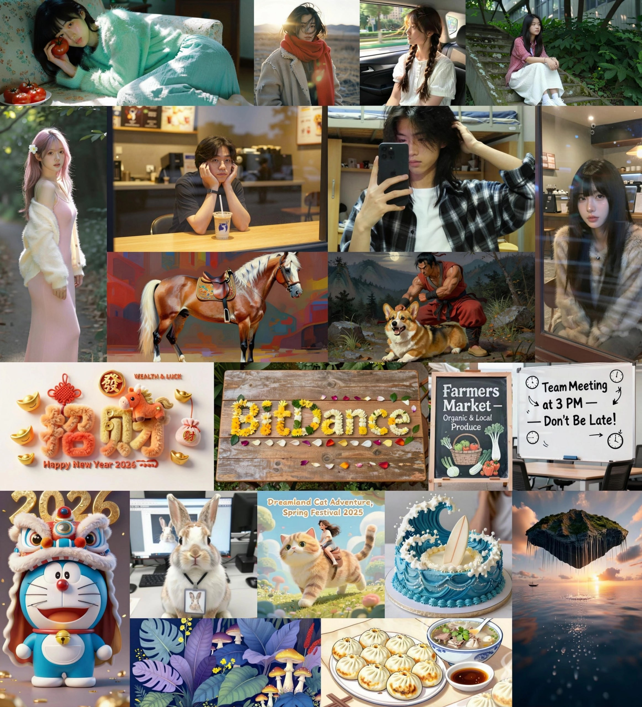

# Image Description

**File:** img_1771386428_aqadrhjrgya9ouh8_dreamlianaicatsadventure_sprinai_estival.jpg
**Original:** image.jpg
**Received:** 1771386428

## Extracted Text (OCR)

DreamlianaiCatsAdventure, = Sprinai-estivalrz025

— Don't Be Late!

## Usage Instructions

When referencing this image in markdown:
1. Use relative path based on file location
2. Add descriptive alt text based on OCR content above
3. Add text description BELOW the image for GitHub rendering

Example:
```markdown
 <!-- TODO: Broken image path -->

**Image shows:** [Describe what the image contains based on OCR]
```
