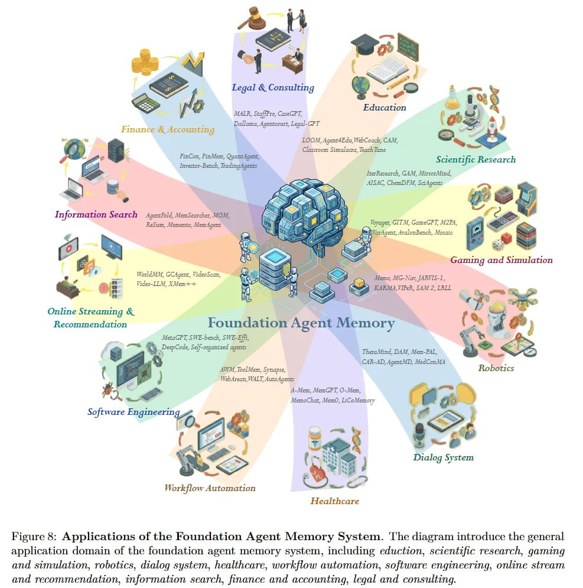

# Image Description

**File:** img_1771471849_aqadabzrgxwrkeh_figure_9_applications_of_the_foundation.jpg
**Original:** image.jpg
**Received:** 1771471849

## Extracted Text (OCR)

Figure 9: Applications of the Foundation Agent Memory System. 'lhe diagram introduce the general application domain of the foundation agent memory system, including eduction, scientific research, gaming and simulation, robotics, dialog system, healthcare, workfiow automation, software engineering, online stream and recommendation, information. search, finance and accounting, legal and consulting.

<!-- image -->

## Usage Instructions

When referencing this image in markdown:
1. Use relative path based on file location
2. Add descriptive alt text based on OCR content above
3. Add text description BELOW the image for GitHub rendering

Example:
```markdown
 <!-- TODO: Broken image path -->

**Image shows:** [Describe what the image contains based on OCR]
```
