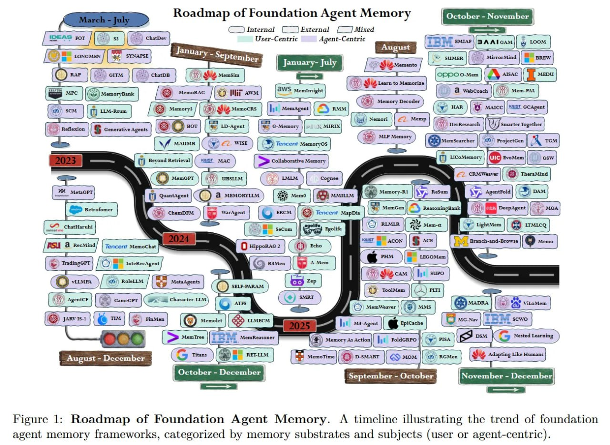

# Image Description

**File:** img_1771471849_aqadxhzrgxwrkeh_figure_1_roadmap_of_foundation_agent.jpg
**Original:** image.jpg
**Received:** 1771471849

## Extracted Text (OCR)

Figure 1: Roadmap of Foundation Agent Memory. A timeline illustrating the trend of foundation agent memory frameworks, categorized by memory substrates and subjects (user or agent-centric).

<!-- image -->

## Usage Instructions

When referencing this image in markdown:
1. Use relative path based on file location
2. Add descriptive alt text based on OCR content above
3. Add text description BELOW the image for GitHub rendering

Example:
```markdown
 <!-- TODO: Broken image path -->

**Image shows:** [Describe what the image contains based on OCR]
```
