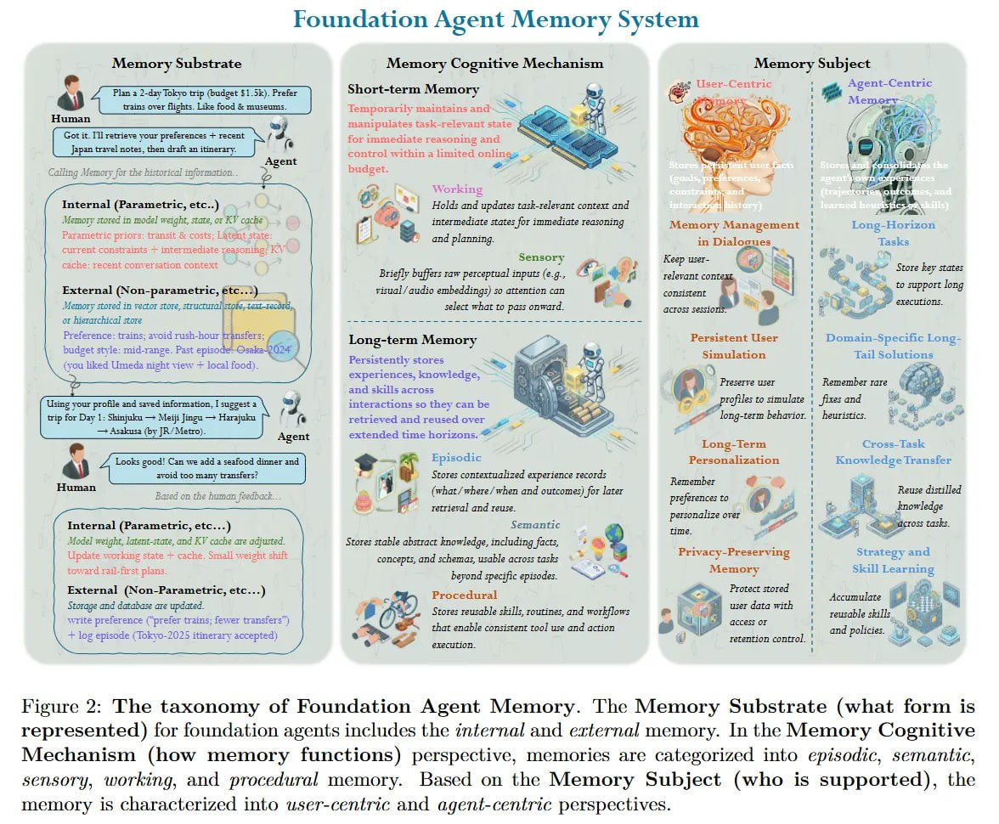

# Image Description

**File:** img_1771471849_aqadxxzrgxwrkeh_foundation_agent_memory_system_figure.jpg
**Original:** image.jpg
**Received:** 1771471849

## Extracted Text (OCR)

## Foundation Agent Memory System

Figure 2: The taxonomy of Foundation Agent Memory. The Memory Substrate (what form is represented) for foundation agents includes the internal and external memory. In the Memory Cognitive Mechanism (how memory functions) perspective, memories are categorized into episodic, semantic, sensory, working, and procedural memory. Based on the Memory Subject (who is supported), the memory is characterized into user-centric and agent-centric perspectives.

<!-- image -->

## Usage Instructions

When referencing this image in markdown:
1. Use relative path based on file location
2. Add descriptive alt text based on OCR content above
3. Add text description BELOW the image for GitHub rendering

Example:
```markdown
 <!-- TODO: Broken image path -->

**Image shows:** [Describe what the image contains based on OCR]
```
