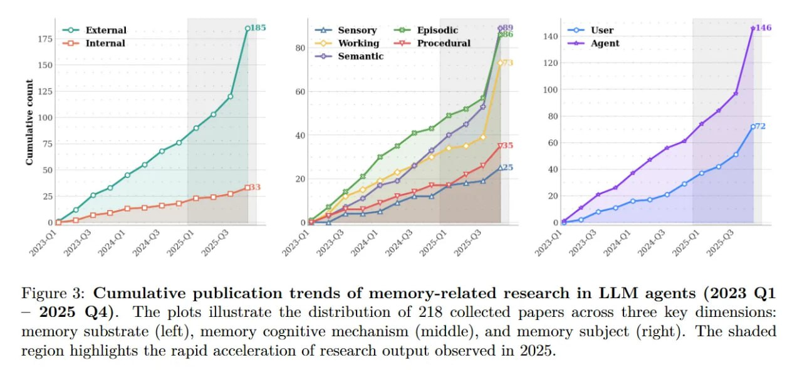

# Image Description

**File:** img_1771471849_aqadybzrgxwrkeh_figure_3_cumulative_publication_trends_o.jpg
**Original:** image.jpg
**Received:** 1771471849

## Extracted Text (OCR)

Figure 3: Cumulative publication trends of memory-related research in LLM agents (2023 Q1 — 2025 Q4). The plots illustrate the distribution of 218 collected papers across three key dimensions: memory substrate (left), memory cognitive mechanism (middle), and memory subject (right). The shaded region highlights the rapid acceleration of research output observed in 2025.

<!-- image -->

## Usage Instructions

When referencing this image in markdown:
1. Use relative path based on file location
2. Add descriptive alt text based on OCR content above
3. Add text description BELOW the image for GitHub rendering

Example:
```markdown
 <!-- TODO: Broken image path -->

**Image shows:** [Describe what the image contains based on OCR]
```
