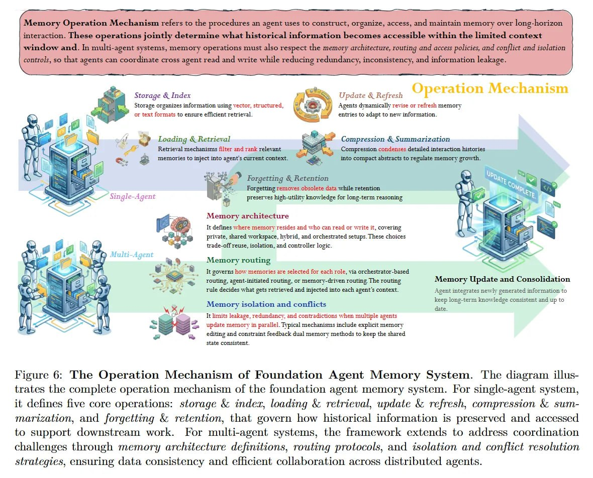

# Image Description

**File:** img_1771471849_aqadyhzrgxwrkeh_image_figure_6_the.jpg
**Original:** image.jpg
**Received:** 1771471849

## Extracted Text (OCR)

<!-- image -->

Figure 6: The Operation Mechanism of Foundation Agent Memory System. The diagram illustrates the complete operation mechanism of the foundation agent memory system. For single-agent system, it defines five core operations: storage &amp; index, loading &amp; retrieval, update &amp; refresh, compression &amp; summarization, and forgetting &amp; retention, that govern how historical information is preserved and accessed to support downstream work. For multi-agent systems, the framework extends to address coordination challenges through memory architecture definitions, routing protocols, and isolation and conflict resolution strategies, ensuring data consistency and efficient collaboration across distributed agents.

## Usage Instructions

When referencing this image in markdown:
1. Use relative path based on file location
2. Add descriptive alt text based on OCR content above
3. Add text description BELOW the image for GitHub rendering

Example:
```markdown
 <!-- TODO: Broken image path -->

**Image shows:** [Describe what the image contains based on OCR]
```
