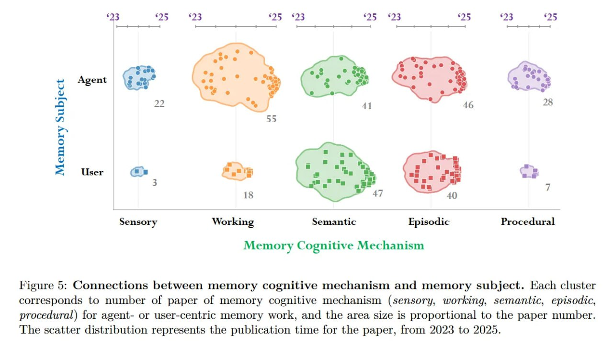

# Image Description

**File:** img_1771471849_aqadyrzrgxwrkeh_image_memory_cognitive_mechanism.jpg
**Original:** image.jpg
**Received:** 1771471849

## Extracted Text (OCR)

<!-- image -->

Memory Cognitive Mechanism

Figure 5: Connections between memory cognitive mechanism and memory subject. Each cluster corresponds to number of paper of memory cognitive mechanism (sensory, working, semantic, episodic, procedural) for agent- or user-centric memory work, and the area size is proportional to the paper number. The scatter distribution represents the publication time for the paper, from 2023 to 2025.

## Usage Instructions

When referencing this image in markdown:
1. Use relative path based on file location
2. Add descriptive alt text based on OCR content above
3. Add text description BELOW the image for GitHub rendering

Example:
```markdown
 <!-- TODO: Broken image path -->

**Image shows:** [Describe what the image contains based on OCR]
```
