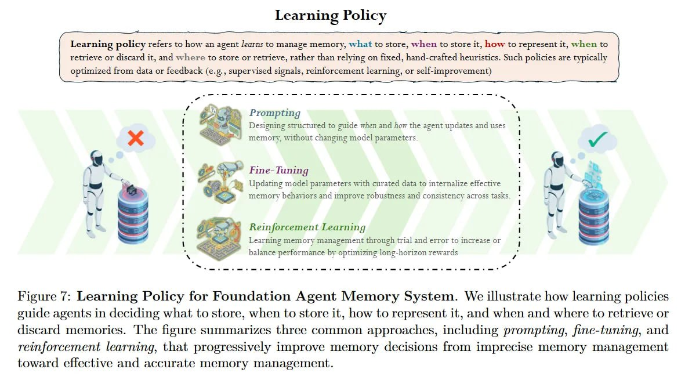

# Image Description

**File:** img_1771471849_aqadyxzrgxwrkeh_image_learning_policy.jpg
**Original:** image.jpg
**Received:** 1771471849

## Extracted Text (OCR)

<!-- image -->

## Learning Policy

Learning policy refers to how an agent Jearns to manage memory, what to store, when to store it, how to represent it, when to retrieve or discard it, and where to store or retrieve, rather than relying on fixed, папа-сгаНеа heuristics. Such policies are typically optimized from data or feedback (e€.¢., supervised signals, reinforcement learning, or self-improvement)

<!-- image -->

<!-- image -->

<!-- image -->

## Prompting

Designing structured to Tuide When and пот the agent updates and uses memory, without changing model parameters.

Fine- funing

ae

Updating model parameters With curated data to internalize etiective memory behaviers and improve robustness and consistency across tasks.

Reinforcement Learning I -

Learning memory Management througn trial and error to increase or Dalance performance by optimizing long-horizon rewards ee a ьЬ м a le

Figure 7: Learning Policy for Foundation Agent Memory System. We illustrate how learning policies euide agents in deciding what to store, when to store it, how to represent it, and when and where to retrieve or discard memories. 'The hgure summarizes three common approaches, including prompting, fine-tuning, and reinforcement learning, that progressively improve memory decisions from imprecise memory management toward effective and accurate memory management.

<!-- image -->

## Usage Instructions

When referencing this image in markdown:
1. Use relative path based on file location
2. Add descriptive alt text based on OCR content above
3. Add text description BELOW the image for GitHub rendering

Example:
```markdown
 <!-- TODO: Broken image path -->

**Image shows:** [Describe what the image contains based on OCR]
```
