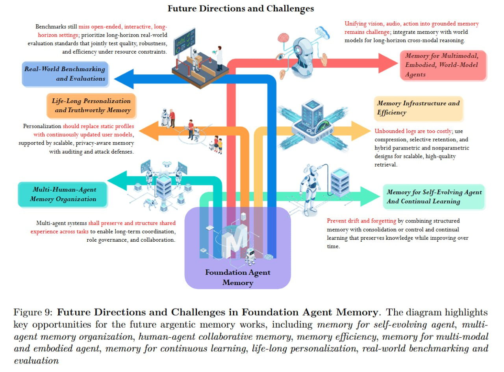

# Image Description

**File:** img_1771471849_aqadzhzrgxwrkeh_future_directions_and_challenges_figure.jpg
**Original:** image.jpg
**Received:** 1771471849

## Extracted Text (OCR)

## Future Directions and Challenges

Figure 9: Future Directions and Challenges in Foundation Agent Memory. 'The diagram highlights key opportunities for the future argentic memory works, including memory for self-evolving agent, mulliagent memory organization, human-agent collaborative memory, memory efficiency, memory for multi-modal and embodied agent, memory for continuous learning, life-long personalization, real-world benchmarking and evaluation

<!-- image -->

## Usage Instructions

When referencing this image in markdown:
1. Use relative path based on file location
2. Add descriptive alt text based on OCR content above
3. Add text description BELOW the image for GitHub rendering

Example:
```markdown
 <!-- TODO: Broken image path -->

**Image shows:** [Describe what the image contains based on OCR]
```
