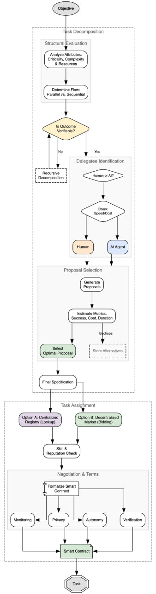

# Image Description

**File:** img_1771471872_aqadybhrgxwrmeh_lecompasition_ptoo0sa_selechon_negotiati.jpg
**Original:** image.jpg
**Received:** 1771471872

## Extracted Text (OCR)

Тю Lecompasition

PTOO0Sa! selechon

Negotiation &amp; terms

## Usage Instructions

When referencing this image in markdown:
1. Use relative path based on file location
2. Add descriptive alt text based on OCR content above
3. Add text description BELOW the image for GitHub rendering

Example:
```markdown
 <!-- TODO: Broken image path -->

**Image shows:** [Describe what the image contains based on OCR]
```
