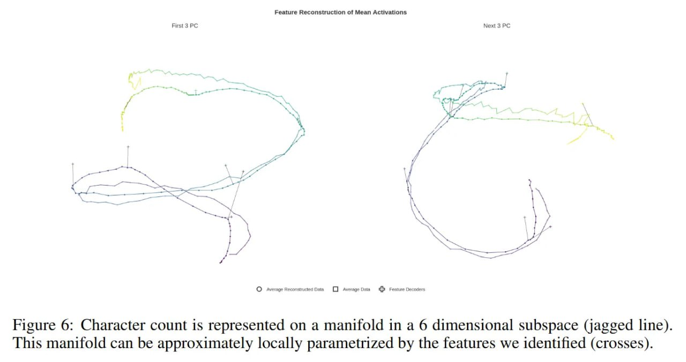

# Image Description

**File:** img_1771471921_aqad1bvrgxb2oeh_figure_6_character_count_1s_represented.jpg
**Original:** image.jpg
**Received:** 1771471921

## Extracted Text (OCR)

Figure 6: Character count 1s represented on a manifold 1n a 6 dimensional subspace (jagged line). This manifold can be approximately locally parametrized by the features we identified (crosses).

<!-- image -->

## Usage Instructions

When referencing this image in markdown:
1. Use relative path based on file location
2. Add descriptive alt text based on OCR content above
3. Add text description BELOW the image for GitHub rendering

Example:
```markdown
 <!-- TODO: Broken image path -->

**Image shows:** [Describe what the image contains based on OCR]
```
