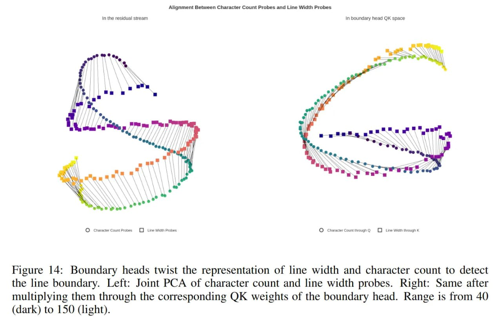

# Image Description

**File:** img_1771471921_aqad1xvrgxb2oeh_figure_14_boundary_heads_twist_the.jpg
**Original:** image.jpg
**Received:** 1771471921

## Extracted Text (OCR)

Figure 14: Boundary heads twist the representation of line width and character count to detect the line boundary. Left: Joint PCA of character count and line width probes. Right: Same after multiplying them through the corresponding QK weights of the boundary head. Range is from 40 (dark) to 150 (light).

<!-- image -->

## Usage Instructions

When referencing this image in markdown:
1. Use relative path based on file location
2. Add descriptive alt text based on OCR content above
3. Add text description BELOW the image for GitHub rendering

Example:
```markdown
 <!-- TODO: Broken image path -->

**Image shows:** [Describe what the image contains based on OCR]
```
