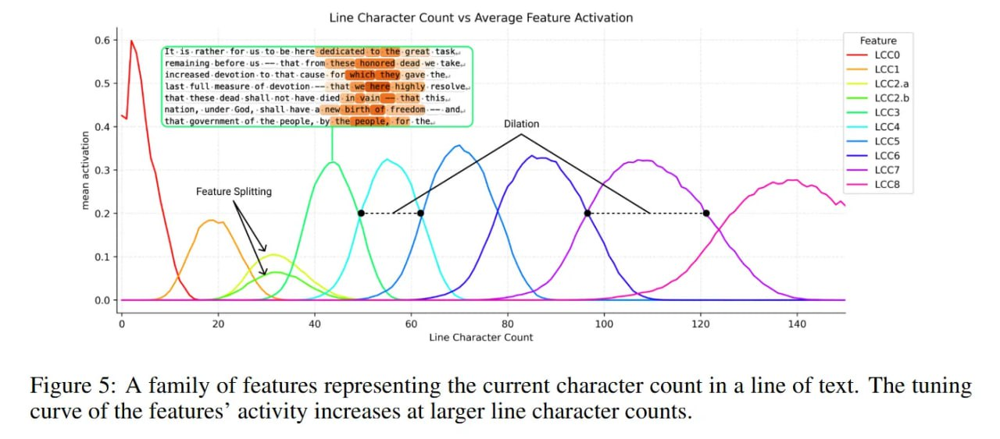

# Image Description

**File:** img_1771471921_aqad3bvrgxb2oeh_figure_5_a_family_of_features.jpg
**Original:** image.jpg
**Received:** 1771471921

## Extracted Text (OCR)

Figure 5: A family of features representing the current character count in a line of text. The tuning curve of the features' activity increases at larger line character counts.

<!-- image -->

## Usage Instructions

When referencing this image in markdown:
1. Use relative path based on file location
2. Add descriptive alt text based on OCR content above
3. Add text description BELOW the image for GitHub rendering

Example:
```markdown
 <!-- TODO: Broken image path -->

**Image shows:** [Describe what the image contains based on OCR]
```
