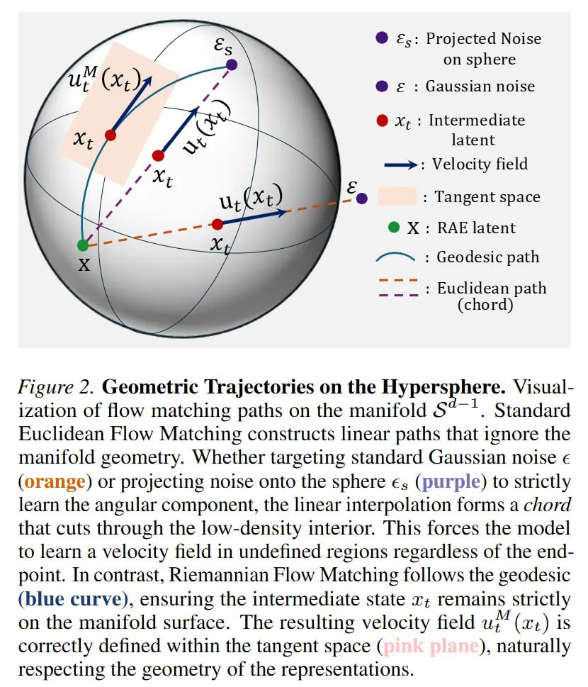

# Image Description

**File:** img_1771471984_aqadqxvrgxb2seh_figure_2_geometric_trajectories_on_the.jpg
**Original:** image.jpg
**Received:** 1771471984

## Extracted Text (OCR)

Figure 2. Geometric Trajectories on the Hypersphere. Visualization of flow matching paths on the manifold S® ~. Standard Ruclidean Flow Matching constructs linear paths that 1gnore the manifold geometry. Whether targeting standard Gaussian noise е (orange) or projecting noise onto the sphere €, (purple) to strictly learn the angular component, the linear interpolation forms a chord that cuts through the low-density interior. [his forces the model to learn a velocity field in undefined regions regardless of the endpoint. In contrast, Riemannian Flow Matching follows the geodesic (blue curve), ensuring the intermediate state x; remains strictly on the manifold surface. The resulting velocity field иг" (ть) is correctly defined within the tangent space ( ), naturally respecting the geometry of the representations.

<!-- image -->

## Usage Instructions

When referencing this image in markdown:
1. Use relative path based on file location
2. Add descriptive alt text based on OCR content above
3. Add text description BELOW the image for GitHub rendering

Example:
```markdown
 <!-- TODO: Broken image path -->

**Image shows:** [Describe what the image contains based on OCR]
```
