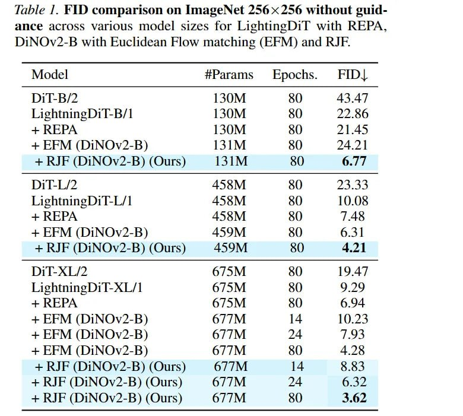

# Image Description

**File:** img_1771471984_aqadsbvrgxb2seh9_fable_comparison_on_imagenet.jpg
**Original:** image.jpg
**Received:** 1771471984

## Extracted Text (OCR)

fable /. НО comparison on ImageNet 256 x 256 without guidance across various model sizes for LightingDil with КЕРА. DiNOv2-B with Euclidean Fiow matching (EFM) and КР.

| Model #Params Epochs. FID              |
|----------------------------------------|
| Di |-B/?2                              |
| Lightning) I-b/ 1 130M 80 22.66        |
| + ВВМ (DiNOv2-B) 131M 80 24.2 |        |
| + RJF (DiNOv2-B) (Ours) I35I1M 80 6.77 |
| LightningD11-L/] 456M 80 10.08         |
| + REM (DiNOv?2-B)  45  OM  80          |
| + КЕ (DiNOv2-B) (Ours) 459M 80 4.21    |
| LightninegDil-xXL/1 6/5M 80 9.29       |
| + REPA  6/5M  0  6.94                  |
| + ВВМ (DiNOv?2-5B) 6//M 14 10.253      |
| + REM (DiNOv?2-B) 6//M 24 ESS          |
| + RFM (DiNOv2-B) 67/M 80 4.28          |
| + М (DiNOv2-B)(Qurs) 6//M 14 6.03      |
| + МЕ (DiNOv2-B) (Ours) 6//M 24 6.32    |
| + RJF (DiNOv2-B) (Ours) 677M 80 3.62   |

## Usage Instructions

When referencing this image in markdown:
1. Use relative path based on file location
2. Add descriptive alt text based on OCR content above
3. Add text description BELOW the image for GitHub rendering

Example:
```markdown
 <!-- TODO: Broken image path -->

**Image shows:** [Describe what the image contains based on OCR]
```
