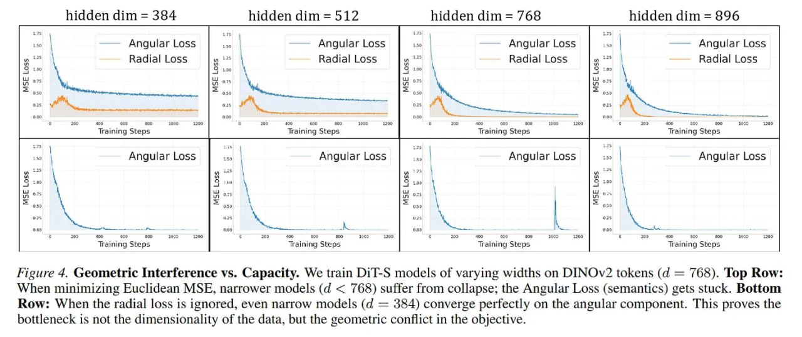

# Image Description

**File:** img_1771471984_aqadshvrgxb2seh_figure_4_geometric_interference_vs_capac.jpg
**Original:** image.jpg
**Received:** 1771471984

## Extracted Text (OCR)

Figure 4. Geometric Interference vs. Capacity. We train DiI-S models of varying widths on DINOv2 tokens (а = 768). Top Row: When minimizing Euclidean MSE, narrower models (d &lt; 768) suffer from collapse; the Angular Loss (semantics) gets stuck. Bottom Ком: When the radial loss is ignored, even narrow models (а = 384) converge perfectly on the angular component. [This proves the bottleneck is not the dimensionality of the data, but the geometric conflict in the objective.

<!-- image -->

## Usage Instructions

When referencing this image in markdown:
1. Use relative path based on file location
2. Add descriptive alt text based on OCR content above
3. Add text description BELOW the image for GitHub rendering

Example:
```markdown
 <!-- TODO: Broken image path -->

**Image shows:** [Describe what the image contains based on OCR]
```
