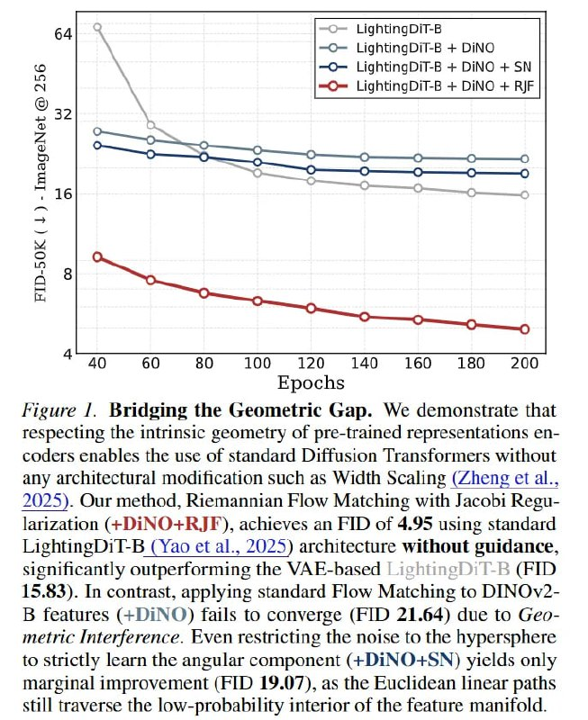

# Image Description

**File:** img_1771471984_aqadsrvrgxb2seh9_figure_bridging_the_geometric_gap.jpg
**Original:** image.jpg
**Received:** 1771471984

## Extracted Text (OCR)

Figure Г. Bridging the Geometric Gap. We demonstrate that respecting the intrinsic geometry of pre-trained representations encoders enables the use ot standard littusion lranstormers without any architectural modification such as Width Scaling (Zheng et al., 2025). Our method, Riemannian Flow Matching with Jacobi Resularization (+DiINO+R JF), achieves an FID of 4.95 using standard LightineDil-bB ( Yao et al., 2025) architecture without guidance, significantly outperforming the VAFE-based (ЮО 15.85). In contrast, applying standard Flow Matching to DINOv2В features (+U1N©) fails to converge (FID 21.64) due to Geometric Interference. Even restricting the noise to the hypersphere to strictly learn the angular component (+DiNO+SN) yields only marginal improvement (FID 19.07), as the Ruciidean linear paths still traverse the low-probability interior of the feature manifold.

<!-- image -->

## Usage Instructions

When referencing this image in markdown:
1. Use relative path based on file location
2. Add descriptive alt text based on OCR content above
3. Add text description BELOW the image for GitHub rendering

Example:
```markdown
 <!-- TODO: Broken image path -->

**Image shows:** [Describe what the image contains based on OCR]
```
