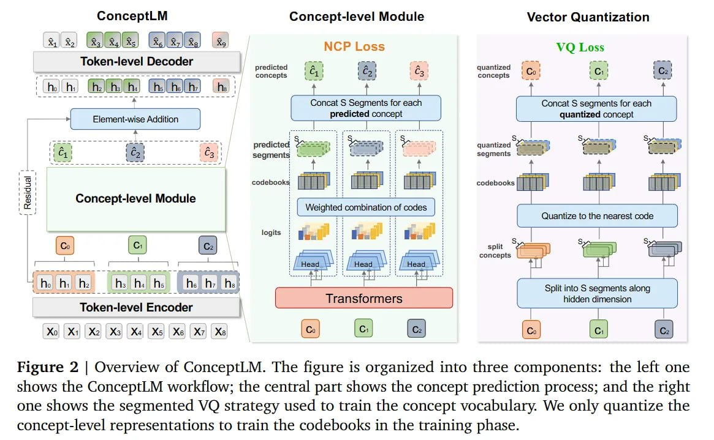

# Image Description

**File:** img_1772263798_aqadrxrrgzltweh_figure_2_overview_of_conceptlm.jpg
**Original:** image.jpg
**Received:** 1772263798

## Extracted Text (OCR)

Figure 2 | Overview of ConceptLM. The figure is organized into three components: the left one shows the ConceptLM workflow; the central part shows the concept prediction process; and the right one shows the segmented VO strategy used to train the concept vocabulary. We only quantize the concept-level representations to train the codebooks in the training phase.

<!-- image -->

## Usage Instructions

When referencing this image in markdown:
1. Use relative path based on file location
2. Add descriptive alt text based on OCR content above
3. Add text description BELOW the image for GitHub rendering

Example:
```markdown
 <!-- TODO: Broken image path -->

**Image shows:** [Describe what the image contains based on OCR]
```
