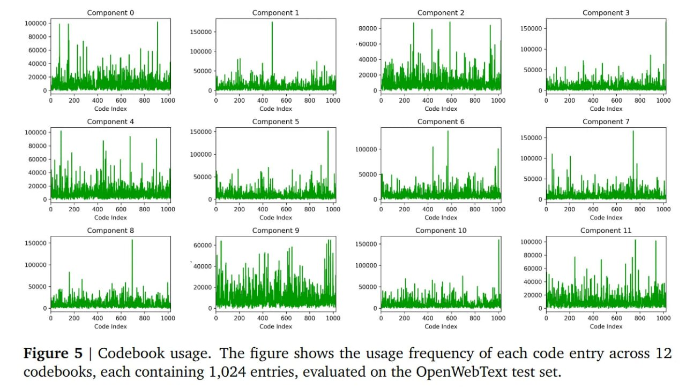

# Image Description

**File:** img_1772263798_aqadsrrrgzltweh_figure_5_codebook_usage_the.jpg
**Original:** image.jpg
**Received:** 1772263798

## Extracted Text (OCR)

Figure 5 | Codebook usage. The figure shows the usage frequency of each code entry across 12 codebooks, each containing 1,024 entries, evaluated on the OpenWebText test set.

<!-- image -->

## Usage Instructions

When referencing this image in markdown:
1. Use relative path based on file location
2. Add descriptive alt text based on OCR content above
3. Add text description BELOW the image for GitHub rendering

Example:
```markdown
 <!-- TODO: Broken image path -->

**Image shows:** [Describe what the image contains based on OCR]
```
