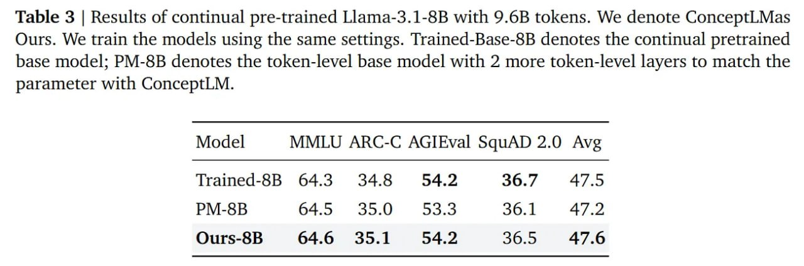

# Image Description

**File:** img_1772263798_aqadtbrrgzltweh_table_3_results_of_continual.jpg
**Original:** image.jpg
**Received:** 1772263798

## Extracted Text (OCR)

Table 3 | Results of continual pre-trained Llama-3.1-8B with 9.6B tokens. We denote ConceptLMas Ours. We train the models using the same settings. Trained-Base-8B denotes the continual pretrained базе model; PM-8B denotes the token-level base model with 2 more token-level layers to match the parameter with ConceptLM.

|                                  | Model MMLU ARC-C AGIEval SquAD 2.0 Avg   |
|----------------------------------|------------------------------------------|
| Trained-8B 643 348 542 36.7 47.5 |                                          |
| PM-8B 645 35.0 #£=53.3 36.1 al   |                                          |
| Ours-8B 64.6 35.1 £542 365 47.6  |                                          |

## Usage Instructions

When referencing this image in markdown:
1. Use relative path based on file location
2. Add descriptive alt text based on OCR content above
3. Add text description BELOW the image for GitHub rendering

Example:
```markdown
 <!-- TODO: Broken image path -->

**Image shows:** [Describe what the image contains based on OCR]
```
