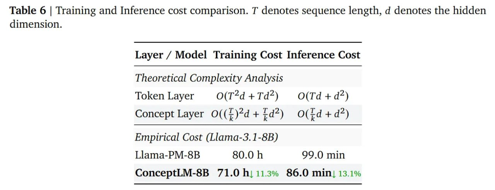

# Image Description

**File:** img_1772263798_aqadthrrgzltweh_table_6_training_and_inference.jpg
**Original:** image.jpg
**Received:** 1772263798

## Extracted Text (OCR)

Table 6 | Training and Inference cost comparison. T denotes sequence length, d denotes the hidden dimension.

<!-- image -->

| Layer / Model Training Cost Inference Cost   | Layer / Model Training Cost Inference Cost   | Layer / Model Training Cost Inference Cost   |
|----------------------------------------------|----------------------------------------------|----------------------------------------------|
| Theoretical Complexity Analysis              | Theoretical Complexity Analysis              | Theoretical Complexity Analysis              |
|                                              | Token Layer O(T“d+Td*) O(Td+d7*)             |                                              |
|                                              | Concept Layer O((4)*d + г4*} O(¢d+d7*)       |                                              |
| Emptrical Cost (Llama-3.1-8B)                | Emptrical Cost (Llama-3.1-8B)                | Emptrical Cost (Llama-3.1-8B)                |
| Llama-PM-8B 80.0 h 99.0 min                  |                                              |                                              |
| ConceptLM-8B 71.0 В 11.3% 86.0 min) 13.1%    |                                              |                                              |

## Usage Instructions

When referencing this image in markdown:
1. Use relative path based on file location
2. Add descriptive alt text based on OCR content above
3. Add text description BELOW the image for GitHub rendering

Example:
```markdown
 <!-- TODO: Broken image path -->

**Image shows:** [Describe what the image contains based on OCR]
```
