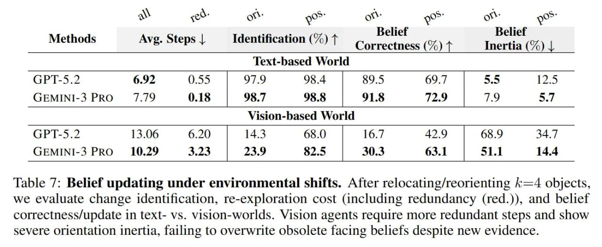

# Image Description

**File:** img_1772263838_aqadphrrgzltyeh_methods_avg_steps.jpg
**Original:** image.jpg
**Received:** 1772263838

## Extracted Text (OCR)

|                    | Methods Avg. Steps | Identification (%) 1 Cnreccmness (%) 4 Inertia (%) |   | Methods Avg. Steps | Identification (%) 1 Cnreccmness (%) 4 Inertia (%) |   |
|--------------------|-----------------------------------------------------------------------------|-----------------------------------------------------------------------------|
| (;PT-5.?           |                                                                             |                                                                             |
| (SEMINI-3 PRO  779 |                                                                             |                                                                             |
| (;EMINI-3 PRO      |                                                                             |                                                                             |

Table 7: Belief updating under environmental shifts. After relocating/reorienting к=4 objects, we evaluate change identification, re-exploration cost (including redundancy (red.)), and belief correctness/update 1п text- vs. vision-worlds. Vision agents require more redundant steps and show severe orientation inertia, failing to overwrite obsolete facing beliefs despite new evidence.

## Usage Instructions

When referencing this image in markdown:
1. Use relative path based on file location
2. Add descriptive alt text based on OCR content above
3. Add text description BELOW the image for GitHub rendering

Example:
```markdown
 <!-- TODO: Broken image path -->

**Image shows:** [Describe what the image contains based on OCR]
```
