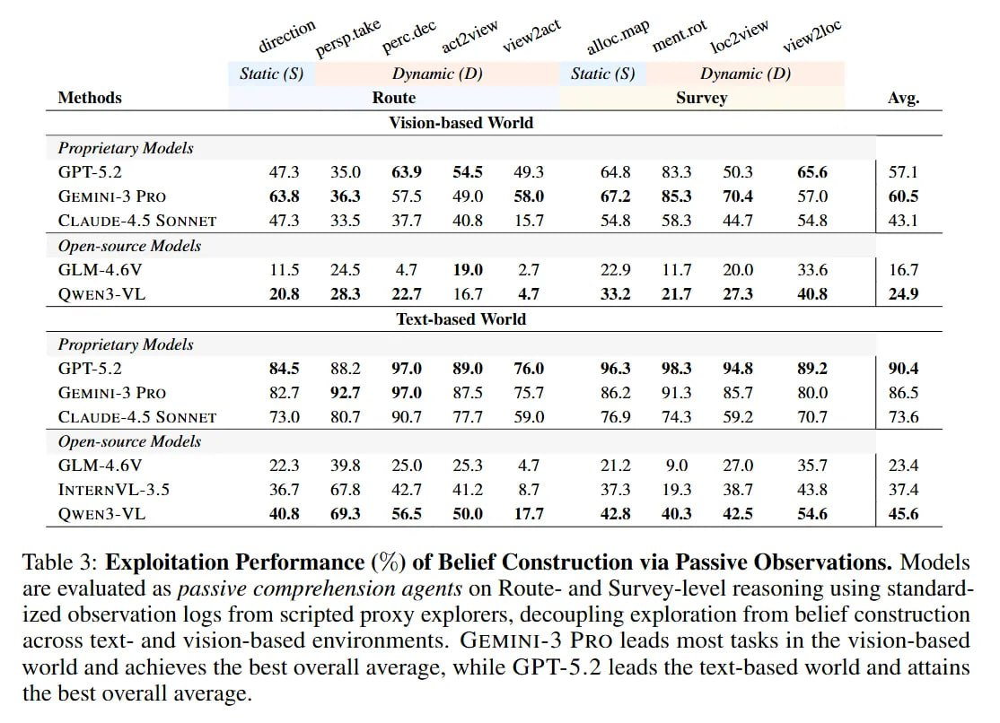

# Image Description

**File:** img_1772263838_aqadprrrgzltyeh_table_3_exploitation_performance_of.jpg
**Original:** image.jpg
**Received:** 1772263838

## Extracted Text (OCR)

Table 3: Exploitation Performance (%) of Belief Construction via Passive Observations. Models are evaluated as passive comprehension agents оп Коше- and Survey-level reasoning using standardized observation logs from scripted proxy explorers, decoupling exploration from belief construction across text- and vision-nased environments. (;EMINI-3 PRO leads most tasks in the vision-hased world and achieves the best overall average, while GP I-5.2 leads the text-based world and attains the best overall average.

|                                                              | Static (S) Dynamic (D) Static (S) Dynamic (D)   | Static (S) Dynamic (D) Static (S) Dynamic (D)   | Static (S) Dynamic (D) Static (S) Dynamic (D)   | Static (S) Dynamic (D) Static (S) Dynamic (D)   |                                                 |                    |                    |                    |                    |                    |
|--------------------------------------------------------------|-------------------------------------------------|-------------------------------------------------|-------------------------------------------------|-------------------------------------------------|-------------------------------------------------|--------------------|--------------------|--------------------|--------------------|--------------------|
|                                                              |                                                 | Methods  Koute  Survey  Avg. Vision-based World | Methods  Koute  Survey  Avg. Vision-based World | Methods  Koute  Survey  Avg. Vision-based World | Methods  Koute  Survey  Avg. Vision-based World |                    |                    |                    |                    |                    |
| Proprietary Models                                           | Proprietary Models                              | Proprietary Models                              | Proprietary Models                              | Proprietary Models                              | Proprietary Models                              | Proprietary Models | Proprietary Models | Proprietary Models | Proprietary Models | Proprietary Models |
| (sEMINI-3 PRO                                                |                                                 |                                                 |                                                 |                                                 |                                                 |                    |                    |                    |                    |                    |
| (|) ALIDE-4.5 SONNET                                         |                                                 |                                                 |                                                 |                                                 |                                                 |                    |                    |                    |                    |                    |
| Open-source Models                                           | Open-source Models                              | Open-source Models                              | Open-source Models                              | Open-source Models                              | Open-source Models                              | Open-source Models | Open-source Models | Open-source Models | Open-source Models | Open-source Models |
| OwWENS-VL 20.8 26.3 Pre | 16.7 4/ 33.2 Я ВЕ. Zl. 40.8 | 24.9 |                                                 |                                                 |                                                 |                                                 |                                                 |                    |                    |                    |                    |                    |
| Text-based World                                             | Text-based World                                | Text-based World                                | Text-based World                                | Text-based World                                | Text-based World                                | Text-based World   | Text-based World   | Text-based World   | Text-based World   | Text-based World   |
| Proprietary Modeis                                           | Proprietary Modeis                              | Proprietary Modeis                              | Proprietary Modeis                              | Proprietary Modeis                              | Proprietary Modeis                              | Proprietary Modeis | Proprietary Modeis | Proprietary Modeis | Proprietary Modeis | Proprietary Modeis |
| (7;EMINI-3 PRO                                               |                                                 |                                                 |                                                 |                                                 |                                                 |                    |                    |                    |                    |                    |
| ( LAUDE-4.5 SONNET                                           |                                                 |                                                 |                                                 |                                                 |                                                 |                    |                    |                    |                    |                    |
| Open-source Models                                           | Open-source Models                              | Open-source Models                              | Open-source Models                              | Open-source Models                              | Open-source Models                              | Open-source Models | Open-source Models | Open-source Models | Open-source Models | Open-source Models |
| INTERN VI-3.4                                                |                                                 |                                                 |                                                 |                                                 |                                                 |                    |                    |                    |                    |                    |
| OQOwWEN3-VL  40.8  69.3  42.8  40.3  42.5  45.6              |                                                 |                                                 |                                                 |                                                 |                                                 |                    |                    |                    |                    |                    |

## Usage Instructions

When referencing this image in markdown:
1. Use relative path based on file location
2. Add descriptive alt text based on OCR content above
3. Add text description BELOW the image for GitHub rendering

Example:
```markdown
 <!-- TODO: Broken image path -->

**Image shows:** [Describe what the image contains based on OCR]
```
