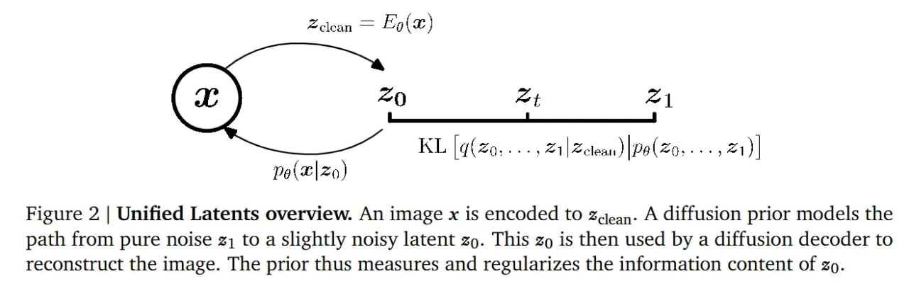

# Image Description

**File:** img_1772263934_aqadirvrgzoq4eh_image_figure_2.jpg
**Original:** image.jpg
**Received:** 1772263934

## Extracted Text (OCR)

<!-- image -->

Figure 2 | Unified Latents overview. An image x is encoded to z,;,,,. A diffusion prior models the path from pure noise #1 to a slightly noisy latent 50. This 50 is then used by a diffusion decoder to reconstruct the image. The prior thus measures and regularizes the information content of 20.

## Usage Instructions

When referencing this image in markdown:
1. Use relative path based on file location
2. Add descriptive alt text based on OCR content above
3. Add text description BELOW the image for GitHub rendering

Example:
```markdown
 <!-- TODO: Broken image path -->

**Image shows:** [Describe what the image contains based on OCR]
```
