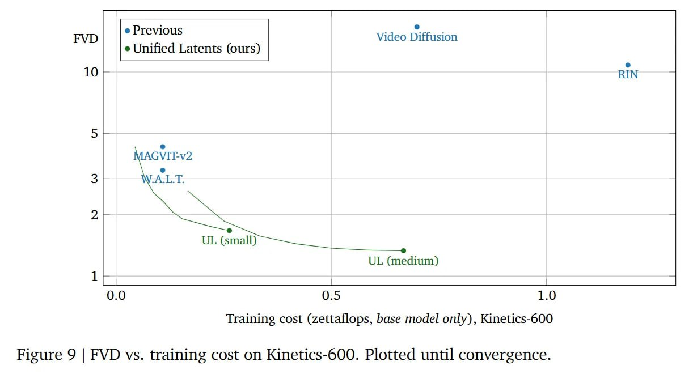

# Image Description

**File:** img_1772263934_aqadkbvrgzoq4eh_image_training_cost_zettaflops.jpg
**Original:** image.jpg
**Received:** 1772263934

## Extracted Text (OCR)

<!-- image -->

Training cost (zettaflops, base model only), Kinetics-600

Figure 9 | FVD vs. training cost on Kinetics-600. Plotted until convergence.

## Usage Instructions

When referencing this image in markdown:
1. Use relative path based on file location
2. Add descriptive alt text based on OCR content above
3. Add text description BELOW the image for GitHub rendering

Example:
```markdown
 <!-- TODO: Broken image path -->

**Image shows:** [Describe what the image contains based on OCR]
```
