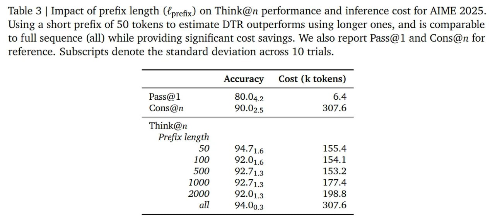

# Image Description

**File:** img_1772263995_aqad2hnrg4hjaafj_table_3_impact_of_prefix.jpg
**Original:** image.jpg
**Received:** 1772263995

## Extracted Text (OCR)

Table 3 | Impact of prefix length (prefix) on Think@n performance and inference cost for AIME 2025. Using a short prefix of 50 tokens to estimate DTR outperforms using longer ones, and is comparable to full sequence (all) while providing significant cost savings. We also report Pass@1 and Cons@n for reference. Subscripts denote the standard deviation across 10 trials.

| Pass@1  80.04 9  6.4 Cons@n 90.09 5 307.6   |
|---------------------------------------------|
| Think@n Prefix length                       |
| 94./16 125.4                                |
| 100 92.01 6 154.1                           |
| 500 92./123 153.2                           |
| 1000 92./13 1//.4                           |
| 2000 92.013 198.3                           |
| all 94.09 3 307.6                           |

## Usage Instructions

When referencing this image in markdown:
1. Use relative path based on file location
2. Add descriptive alt text based on OCR content above
3. Add text description BELOW the image for GitHub rendering

Example:
```markdown
 <!-- TODO: Broken image path -->

**Image shows:** [Describe what the image contains based on OCR]
```
