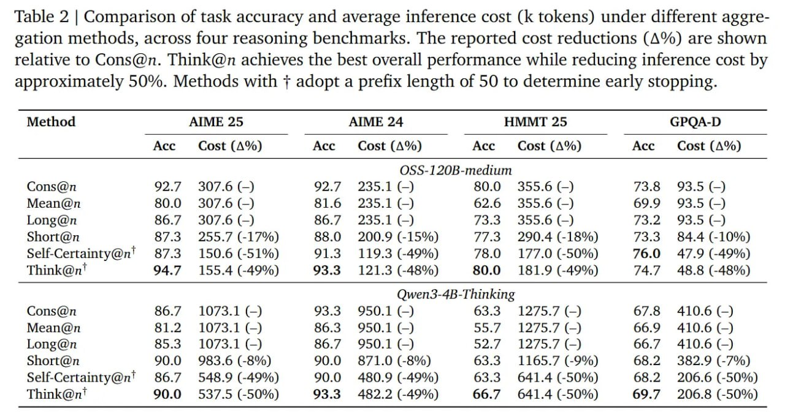

# Image Description

**File:** img_1772263995_aqad3bnrg4hjaafj_table_2_comparison_of_task.jpg
**Original:** image.jpg
**Received:** 1772263995

## Extracted Text (OCR)

Table 2 | Comparison of task accuracy and average inference cost (К tokens) under different aggregation methods, across four reasoning benchmarks. The reported cost reductions (A%) are shown relative to Cons@n. Think@n achieves the best overall performance while reducing inference cost by approximately 50%. Methods with + adopt a prefix length of 50 to determine early stopping.

| Ace                    | Cost (A%)         | АСС               | Cost (A%)         | Acc               | Cost (A%)         | Acc               | Cost (A%)         |
|------------------------|-------------------|-------------------|-------------------|-------------------|-------------------|-------------------|-------------------|
| OSS-] 20B-medium       | OSS-] 20B-medium  | OSS-] 20B-medium  | OSS-] 20B-medium  | OSS-] 20B-medium  | OSS-] 20B-medium  | OSS-] 20B-medium  | OSS-] 20B-medium  |
| Cons@n  92.7           | 307.6 (—)         | 2 /               | 235.1 (—)         |                   | 355.6 (-)         | 3.8               |                   |
| Mean@n 80.0            | 307.6 (—)         |                   | 235.1 (=]         |                   | 355.6 (—)         |                   | 93.5 (-)          |
| Long@n 86.7            | 30/7/.6 (—)       | 86.7              | 235.1 {-)         | fed               | 355.6 (-)         |                   | 93.5 (—)          |
| Short@n  87.3          | 255./ (-1/%)      |                   | 200.9 (-15%)      | A/a               | 290.4 (-18%)      | 73.3              | 34.4 (-10%)       |
| Self-Certainty@n' 87.3 | 150.6 (-51%)      | 1.3               | 119.3 (-49%)      |                   | 177.0 (-50%)      | 76.0              | 47.9 (-49%)       |
| Think@n'‘ 94.7         | 155.4 (-49%)      |                   | 121.3 (-48%)      | =                 | 181.9 (-49%)      |                   | 48.8 (-48%)       |
| Qwen3-4B-Thinking      | Qwen3-4B-Thinking | Qwen3-4B-Thinking | Qwen3-4B-Thinking | Qwen3-4B-Thinking | Qwen3-4B-Thinking | Qwen3-4B-Thinking | Qwen3-4B-Thinking |
| Cons@  п               | 1073.1 (—)        | 0'3 ‘5            | 950.1 {-—)        |                   | 1275.7 (-)        | 67/6              | 410.6 (-)         |
| Mean@n 81.2            | 1073.1 (-)        | 86.3              | 950.1 (—)         |                   | 1275.7 (=)        | H6.9              | 410.6 (—)         |
| Long@n 85.3            | 1073.1 (-)        | $6.7              | 950.1 (-)         | 52./              | 1275.7 (—)        | 66. /             | 410.6 (-)         |
| Short@n 90.0           | 983.6 (-8%)       | 90.0              | 871.0 (-8%)       |                   | 1165.7 (-9%)      |                   | 382.9 (-7%)       |
| Self-Certainty@n' 86.7 | 548.9 (-49%)      |                   | 450.9 (-49%)      | 633               | 641.4 (-50%)      | 68 2              | 206.6 (-50%)      |
| Think@n‘ 90.0          | 537.5 (-50%)      | 93.3              | 482.2 (-49%)      |                   | 641.4 (-50%)      | 69.7              | 200.8 (-50%)      |

## Usage Instructions

When referencing this image in markdown:
1. Use relative path based on file location
2. Add descriptive alt text based on OCR content above
3. Add text description BELOW the image for GitHub rendering

Example:
```markdown
 <!-- TODO: Broken image path -->

**Image shows:** [Describe what the image contains based on OCR]
```
