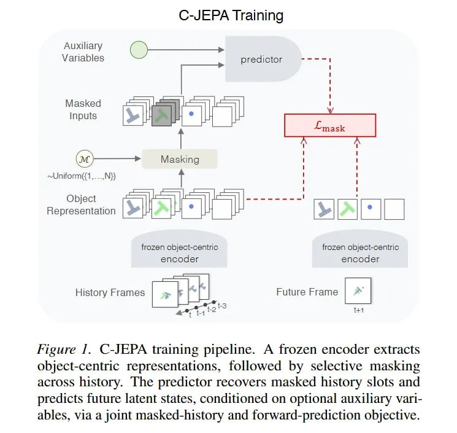

# Image Description

**File:** img_1772344868_aqadmxlrgxlvgul9_c_jepa_iraining_figure_1_c_jepa.jpg
**Original:** image.jpg
**Received:** 1772344868

## Extracted Text (OCR)

## C-JEPA Iraining

Figure 1. C-JEPA training pipeline. A frozen encoder extracts object-centric representations, followed by selective masking across history. [he predictor recovers masked history slots and predicts future latent states, conditioned on optional auxiliary variables, via a joint masked-history and forward-prediction objective.

<!-- image -->

## Usage Instructions

When referencing this image in markdown:
1. Use relative path based on file location
2. Add descriptive alt text based on OCR content above
3. Add text description BELOW the image for GitHub rendering

Example:
```markdown
 <!-- TODO: Broken image path -->

**Image shows:** [Describe what the image contains based on OCR]
```
