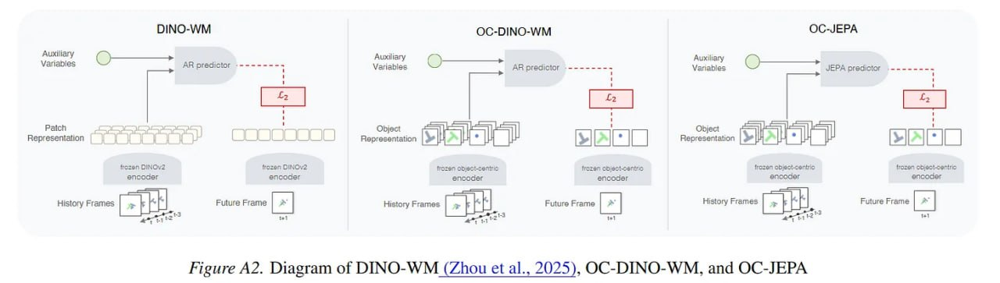

# Image Description

**File:** img_1772344868_aqadnblrgxlvgul_figure_az_diagram_of_dino_wm_zhou.jpg
**Original:** image.jpg
**Received:** 1772344868

## Extracted Text (OCR)

Figure AZ. Diagram of DINO-WM (Zhou et al., 2025), OQC-DINO-WM, and OC-JEPA

<!-- image -->

## Usage Instructions

When referencing this image in markdown:
1. Use relative path based on file location
2. Add descriptive alt text based on OCR content above
3. Add text description BELOW the image for GitHub rendering

Example:
```markdown
 <!-- TODO: Broken image path -->

**Image shows:** [Describe what the image contains based on OCR]
```
