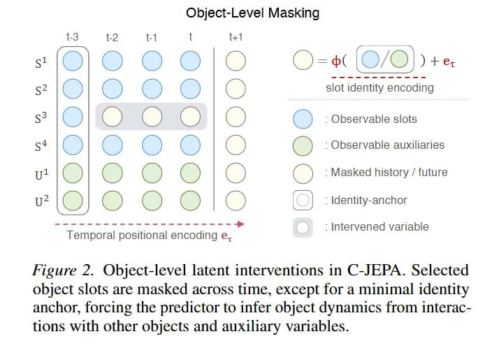

# Image Description

**File:** img_1772344868_aqadnrlrgxlvgul9_figure_2_object_level_latent_interventio.jpg
**Original:** image.jpg
**Received:** 1772344868

## Extracted Text (OCR)

Figure 2. Object-level latent interventions in C-JEPA. Selected object slots are masked across time, except for a minimal identity anchor, forcing the predictor to infer object dynamics trom interactions with other objects and auxiliary variables.

<!-- image -->

## Usage Instructions

When referencing this image in markdown:
1. Use relative path based on file location
2. Add descriptive alt text based on OCR content above
3. Add text description BELOW the image for GitHub rendering

Example:
```markdown
 <!-- TODO: Broken image path -->

**Image shows:** [Describe what the image contains based on OCR]
```
