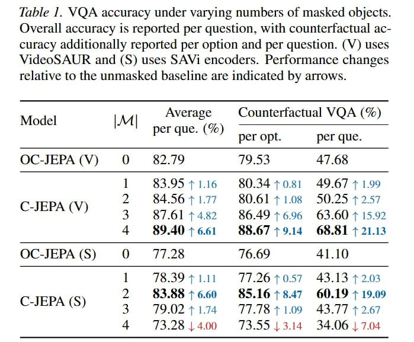

# Image Description

**File:** img_1772344868_aqadnxlrgxlvgul9_lable_1_vqa_accuracy_under_varying.jpg
**Original:** image.jpg
**Received:** 1772344868

## Extracted Text (OCR)

lable 1. VQA accuracy under varying numbers of masked objects. Overall accuracy 1s reported per question, with counterfactual асcuracy additionally reported per option and per question. (№) uses VideoSAUR and (S) uses SAV1 encoders. Performance changes relative to the unmasked baseline are indicated by arrows.

|                             | Average Counterfactual VQA (%)  (Se клал ГЕ“  Model М                                                                                                                | Average Counterfactual VQA (%)  (Se клал ГЕ“  Model М   |
|-----------------------------|----------------------------------------------------------------------------------------------------------------------------------------------------------------------|---------------------------------------------------------|
|                             | per que. (%)  SS ae а Я per opt pt. per que.                                                                                                                         |                                                         |
| A(V) O 5229 49.53 47.65     |                                                                                                                                                                      |                                                         |
|                             | 65.99 71.16 60.5470.81 49.6/ + 1.99 64.56 + 1.77 SU.61 41.08 50.25 72:57 РА) 3 3761 +4 864946096 636041502 4 §$9.4076.61 88.6779.14 68.81 1 21.13                    |                                                         |
| А (S) QO J//.28 16.09 41.10 |                                                                                                                                                                      |                                                         |
|                             | 76.59 Ти. 417.20 10.57 435.15 42.023 63.00 76.60 83.10678.47 60.19 + 19.09 C-JEPA (5) 3 79.02 + 1.74 77.18 - +1 109 43.77 + 2.67 13.2% 1400 //3.5513.14 34.06 | 7.04 |                                                         |

## Usage Instructions

When referencing this image in markdown:
1. Use relative path based on file location
2. Add descriptive alt text based on OCR content above
3. Add text description BELOW the image for GitHub rendering

Example:
```markdown
 <!-- TODO: Broken image path -->

**Image shows:** [Describe what the image contains based on OCR]
```
