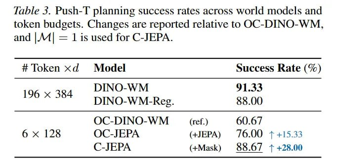

# Image Description

**File:** img_1772344868_aqadoblrgxlvgul9_fable_5_push_1_planning_success_rates.jpg
**Original:** image.jpg
**Received:** 1772344868

## Extracted Text (OCR)

fable 5. Push-1| planning success rates across world models and token budgets. Changes are reported relative to OC-DINO-WM. and |/M| = 11$ used for C-JEPA.

| # Token xd Model Success Rate (%)                                                                  |
|----------------------------------------------------------------------------------------------------|
| DINO-WM 190 x 364  ee) ee  DINO-WM-Reg.                                                            |
| OC-DINO-WM ss (ref.) 60.6 / 6x 128 OC-JEPA (4JEPA) /6.Q00 + 415.33 C-JEPA  (+Mask)  $5.07 + +28.00 |

## Usage Instructions

When referencing this image in markdown:
1. Use relative path based on file location
2. Add descriptive alt text based on OCR content above
3. Add text description BELOW the image for GitHub rendering

Example:
```markdown
 <!-- TODO: Broken image path -->

**Image shows:** [Describe what the image contains based on OCR]
```
