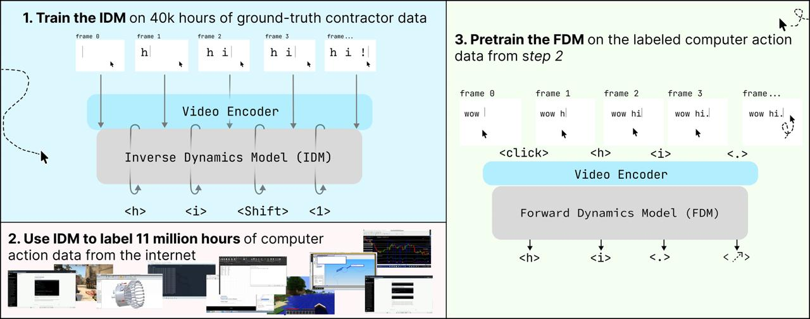

# Image Description

**File:** img_1772362725_aqadrxzrgxmvcul_image_image.jpg
**Original:** image.jpg
**Received:** 1772362725

## Extracted Text (OCR)

<!-- image -->

<!-- image -->

- \_— ae aie iL. | 3. Pretrain the FDM on the labeled computer action 1

1

пт:

| data from step 2

&lt;1&gt; &lt;Shift&gt; &lt;i&gt; Forward Dynamics Model (FDM)

2. Use IDM to label 11 million hours of computer SS ==

action data trom the internet

— |

&lt;j

<!-- image -->

## Usage Instructions

When referencing this image in markdown:
1. Use relative path based on file location
2. Add descriptive alt text based on OCR content above
3. Add text description BELOW the image for GitHub rendering

Example:
```markdown
 <!-- TODO: Broken image path -->

**Image shows:** [Describe what the image contains based on OCR]
```
