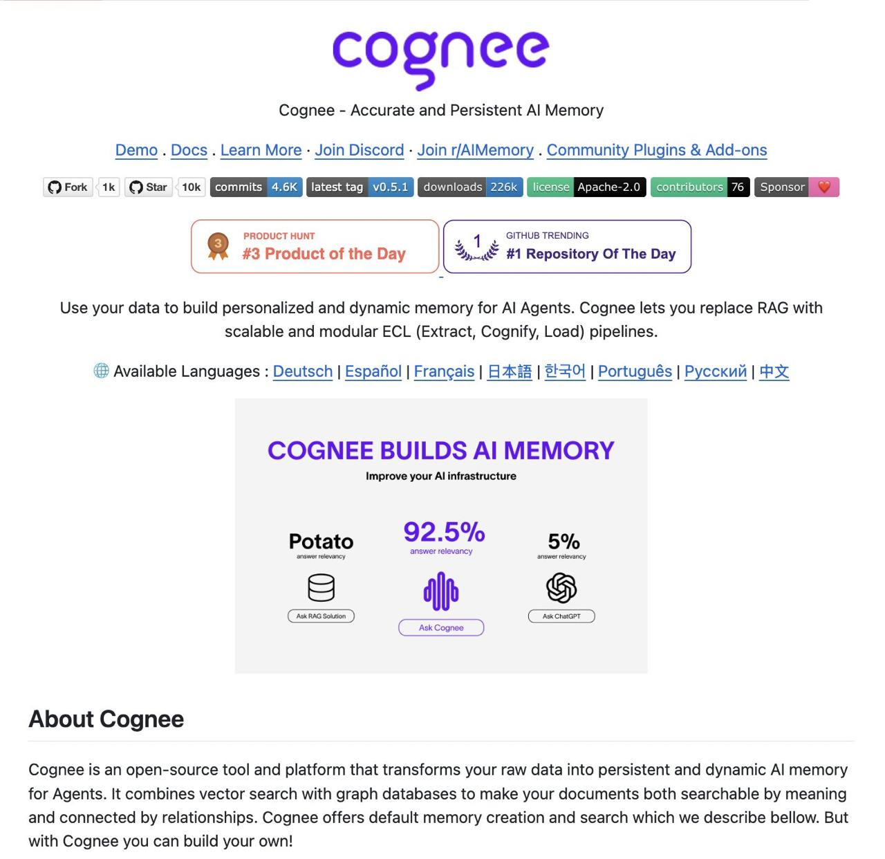

# Image Description

**File:** img_1772422215_aqadwbzrg5pciel_image_about_cognee.jpg
**Original:** image.jpg
**Received:** 1772422215

## Extracted Text (OCR)

<!-- image -->

## About Cognee

Cognee is an open-source tool and platform that transforms your raw data Into persistent and dynamic Al memory for Agents. lt combines vector search with graph databases to make your documents both searchable by meaning and connected by relationships. Cognee offers default memory creation and search which we describe bellow. But with Cognee you can build your own!

## Usage Instructions

When referencing this image in markdown:
1. Use relative path based on file location
2. Add descriptive alt text based on OCR content above
3. Add text description BELOW the image for GitHub rendering

Example:
```markdown
 <!-- TODO: Broken image path -->

**Image shows:** [Describe what the image contains based on OCR]
```
