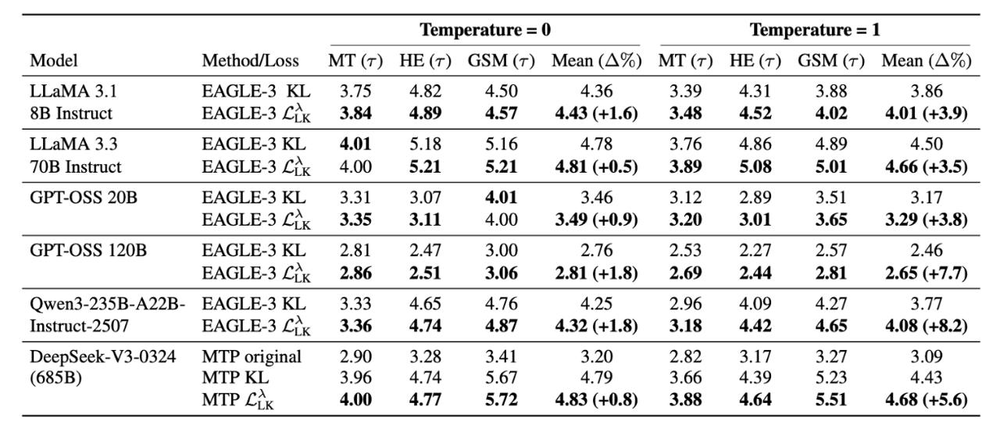

# Image Description

**File:** img_1772511974_aqadbdrgwab7zbjf_model_method_loss.jpg
**Original:** image.jpg
**Received:** 1772511974

## Extracted Text (OCR)

| Model Method/Loss МТ (т) НЕ(Т) СУМ (т) Mean(A%) МТ(т) НЕ(т) GSM(tr) Mean (A%)                                                                                                             |                                                                                                                                            |
|-------------------------------------------------------------------------------------------------------------------------------------------------------------------------------------------|--------------------------------------------------------------------------------------------------------------------------------------------|
| LLaMA 3.1  BAGLE-3 KL  457  450  4 36 ЗВ Instruct EAGLE-3 ДГК 3.84 4.89 4.57 4.43 (+1.6) 3.48 4.52 4.02 4.01 (+3.9)                                                                       |                                                                                                                                            |
|                                                                                                                                                                                           | ТТ аМАЗЗ BRAGLE-3 КГ. 4.01 5.18 5.16 4 78 3 76 486 489 4 50) 70B Instruct EAGLE-3 Li 4.00 5.21 5.21 4.81 (+0.5) 3.89 5.08 5.01 4.66 (+3.5) |
| SS 20B  3 46  3.17  2 89  45]                                                                                                                                                             |                                                                                                                                            |
| EAGLE-3 (^. 3.35 3.11 4.00 3.49 (+0.9) 3.20 3.01 3.65 3.29 (+3.8)                                                                                                                         |                                                                                                                                            |
|                                                                                                                                                                                           | EAGLE-3 Le, 2.86 2.51 3.06 2.31 (+1.8) 2.69 2.44 2.81 2.65 (+7.7)                                                                          |
| Owen3-235B-A22B- EAGLE-3 KL 3.33 4.65 4.16 4.25 2.96 4.09 4.27 ae if                                                                                                                      | Instruct-2507 EAGLE-3 Li, 3.36 4.74 4.87 4.32 (+1.8) 3.18 4.42 4.65 4.08 (+8.2)                                                            |
| DeepSeek-V5-05324 MIP original 2.90 3.28 3.41 3.20 2.02 SLT 3.2.7 5.09 (685B) MTP KL 3.96 4.74 5.67 4.79 3.66 4.39 5.23 4.43 MTP д  4.00 4.77 5.72 4.83 (+0.8) 3.88 4.64 5.51 4.68 (+5.6) |                                                                                                                                            |

## Usage Instructions

When referencing this image in markdown:
1. Use relative path based on file location
2. Add descriptive alt text based on OCR content above
3. Add text description BELOW the image for GitHub rendering

Example:
```markdown
 <!-- TODO: Broken image path -->

**Image shows:** [Describe what the image contains based on OCR]
```
