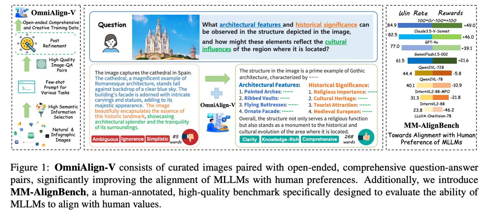

# Image Description

**File:** img_1772682213_aqadpbzrgzqoul_figure_1_omnialign_v_consists_of_curated.jpg
**Original:** image.jpg
**Received:** 1772682213

## Extracted Text (OCR)

Figure 1: OmniAlign-V consists of curated images paired with open-ended, comprehensive question-answer pairs, significantly improving the alignment of MLLMs with human preferences. Additionally, we introduce MM-AlignBench, a human-annotated, high-quality benchmark specifically designed to evaluate the ability of MLLMs to align with human values.

<!-- image -->

## Usage Instructions

When referencing this image in markdown:
1. Use relative path based on file location
2. Add descriptive alt text based on OCR content above
3. Add text description BELOW the image for GitHub rendering

Example:
```markdown
 <!-- TODO: Broken image path -->

**Image shows:** [Describe what the image contains based on OCR]
```
