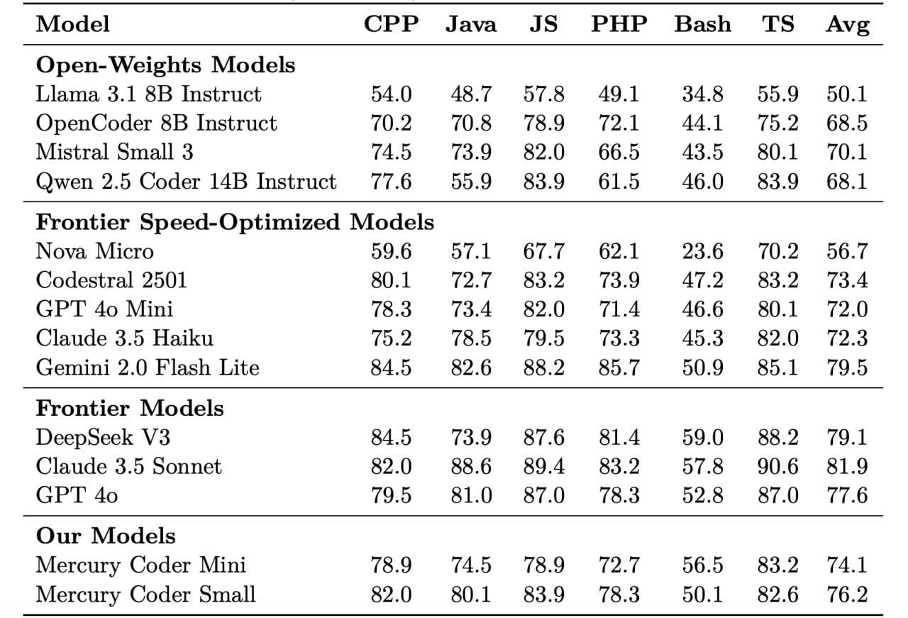

# Image Description

**File:** img_1772682640_aqadobxrg92aueh_model_cpp_java_js_php.jpg
**Original:** image.jpg
**Received:** 1772682640

## Extracted Text (OCR)

| Model CPP Java JS PHP Bash TS Avg                               |
|-----------------------------------------------------------------|
| Open- Weights Models                                            |
| [ата 3.1 “В Instruct  54.0  57.8  AO |  34 8  559 50]           |
| OpenCoder 8B Instruct 10.2 70.8 78.9 72.1 £44.1 475.2 68.5      |
| 74.5  73.9  8&2 ()  66.5  435  50.1  70.1                       |
| Qwen 2.5 Coder 14B Instruct 77.6 55.9 83.9 61.5 46.0 383.9 68.1 |
| Frontier Speed-Optimized Models                                 |
| Nova Micro 506 571 677 0621 36 702 567                          |
| (Sodestral 2501 40] 72.7 532 739 47 5339 734                    |
| (SPT 4o Mini 78.3 734 8290 74 466 З0Т 720                       |
| Claude 3.5 Haiku 752 785 79.5 73.3 453 353290 723               |
| RA 5  3) 6  R&D  85 7  50.9  55]  79.5                          |
| Hrontier Моаесб                                                 |
| DeepsSeek V3 84.5 73.9 87.6 814 59.0 882 79.1                   |
| Claude 3.5 Sonnet 82.0 886 894 332 57.8 90.6 39                 |
| 795  81.0  37 .0)  75 3  5D 8  87.0 77.6                        |
| Our Models                                                      |
| Mercury Coder Mini 78.9 74. 78.9 72.7 56.5 83.2 74.1            |
| Mercury Coder Small 82.0 80.1 83.9 78.3 50.1 82.6 76.2          |

## Usage Instructions

When referencing this image in markdown:
1. Use relative path based on file location
2. Add descriptive alt text based on OCR content above
3. Add text description BELOW the image for GitHub rendering

Example:
```markdown
 <!-- TODO: Broken image path -->

**Image shows:** [Describe what the image contains based on OCR]
```
