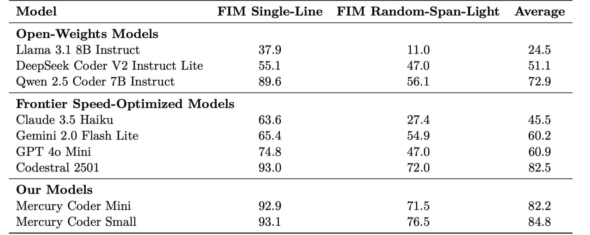

# Image Description

**File:** img_1772682640_aqadohxrg92aueh_model_fim_single_line_fim.jpg
**Original:** image.jpg
**Received:** 1772682640

## Extracted Text (OCR)

|                                                | Model FIM Single-Line FIM Random-Span-Light Average   |
|------------------------------------------------|-------------------------------------------------------|
| Open-Weights Models                            |                                                       |
| Llama 3.1 8B Instruct 37.9 110 р:              |                                                       |
| DeepSeek Coder V2 Instruct Lite 55.1 47.0 51.1 |                                                       |
| Qwen 2.5 Coder 7B Instruct 89.6 56.1 72.9      |                                                       |
| Frontier Speed-Optimized Models                |                                                       |
| Claude 3.5 Haiku 63.6 7 A 455                  |                                                       |
| (;emini 2.0 Flash Lite 65.4 54.9 60.2          |                                                       |
| (;PT 4o Mini TA. 47.0 60.9                     |                                                       |
| Clodestral 9501 93 0 77.0 2 Б                  |                                                       |
| Mercury Coder Mini 92.9 71.5 82.2              |                                                       |
| Mercury Coder Small 93.1 76.5 84.8             |                                                       |

## Usage Instructions

When referencing this image in markdown:
1. Use relative path based on file location
2. Add descriptive alt text based on OCR content above
3. Add text description BELOW the image for GitHub rendering

Example:
```markdown
 <!-- TODO: Broken image path -->

**Image shows:** [Describe what the image contains based on OCR]
```
