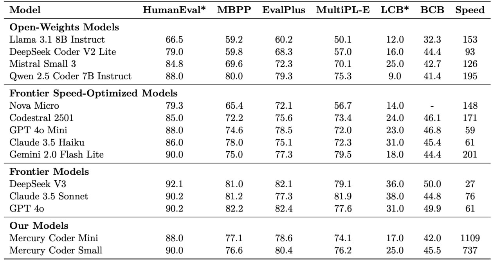

# Image Description

**File:** img_1772682640_aqadorxrg92aueh_model_humaneval_mbpp_evalplus.jpg
**Original:** image.jpg
**Received:** 1772682640

## Extracted Text (OCR)

|                                                                | Model HumanEval* MBPP EvalPlus MultiPL-E LCB* ВСВ Speed   |
|----------------------------------------------------------------|-----------------------------------------------------------|
| Open-Weights Models                                            |                                                           |
| Llama 3.1 8В Instruct 66.5 59.2 60.2 50.1 12.0 39 3 153        |                                                           |
| DeepSeek Coder V2 Lite  79.0  59.8  68.3  57.0  16.0  44.4  93 |                                                           |
| RAK  69.6  7) 3  70.1  25 0  49 7  126                         |                                                           |
| Qwen 2.5 Coder 7B Instruct 88.0 80.0 79.3 75.3 9.0 41.4 195    |                                                           |
| Frontier Speed-Optimized Models                                | Frontier Speed-Optimized Models                           |
| Nova Micro 79.3 65.4 7) 1 56.7 14.0 - 148                      |                                                           |
| (‘odestral 9501 85.0 799 75 6 7324 9A () 46] 17]               |                                                           |
| ‘LT’ do M  ini  &&.0  74.6  78.5  72.0  230  46$  БО           |                                                           |
| Claude 3.5 Haiku  56.0  78.0  75 1  7) 3  31.0  A5.4  61       |                                                           |
| (semini 2.0 Flash Lite 90.0 75.0 773 79.5 18.0 444 70]         |                                                           |
| DeepSeek УЗ  92.1  81.0  82.1  79.1  36.0  50.0  27            |                                                           |
| Claude 3.5 Sonnet  90.2  81.2  77.3  31.9  38.0  44.8  76      |                                                           |
| 90.2  RO 9  ROA  77.6  31.0  499  61                           |                                                           |
| Mercury Coder Mini 88.0 {isk 18.6 74.1 17.0 42.0 1109          |                                                           |
| Mercury Coder Small 90.0 76.6 80.4 76.2 25.0 45.5 737          |                                                           |

## Usage Instructions

When referencing this image in markdown:
1. Use relative path based on file location
2. Add descriptive alt text based on OCR content above
3. Add text description BELOW the image for GitHub rendering

Example:
```markdown
 <!-- TODO: Broken image path -->

**Image shows:** [Describe what the image contains based on OCR]
```
