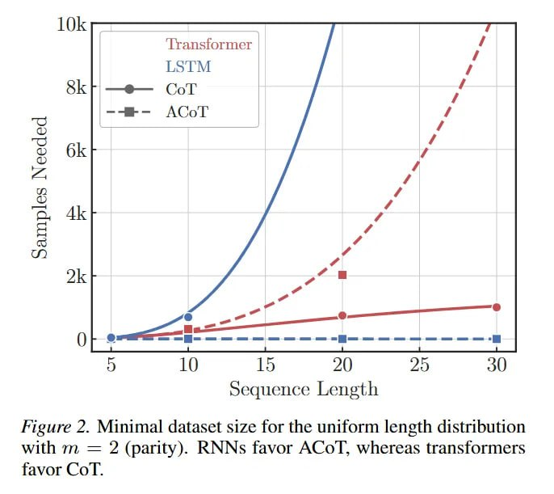

# Image Description

**File:** img_1772682890_aqadvxfrgzm8kel9_figure_2_minimal_dataset_size_for.jpg
**Original:** image.jpg
**Received:** 1772682890

## Extracted Text (OCR)

Figure 2. Minimal dataset size for the uniform length distribution with m = 2 (parity). KNNs favor ACol, whereas transformers tavor Col.

<!-- image -->

## Usage Instructions

When referencing this image in markdown:
1. Use relative path based on file location
2. Add descriptive alt text based on OCR content above
3. Add text description BELOW the image for GitHub rendering

Example:
```markdown
 <!-- TODO: Broken image path -->

**Image shows:** [Describe what the image contains based on OCR]
```
