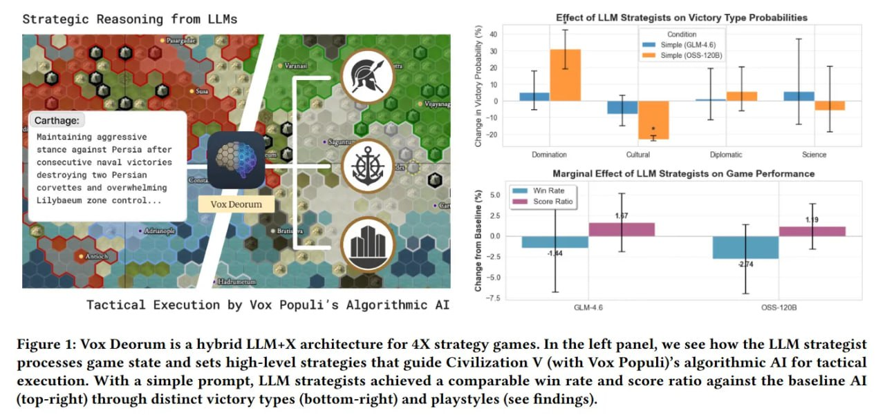

# Image Description

**File:** img_1772683033_aqad5rzrg3vmoel_figure_1_vox_deorum_is_a.jpg
**Original:** image.jpg
**Received:** 1772683033

## Extracted Text (OCR)

Figure 1: Vox Deorum is a hybrid LLM+X architecture for 4X strategy games. In the left panel, we see how the LLM strategist processes game state and sets high-level strategies that guide Civilization У (with Vox Populi)'s algorithmic AI for tactical execution. With a simple prompt, LLM strategists achieved a comparable win rate and score ratio against the baseline Al (top-right) through distinct victory types (bottom-right) and playstyles (see findings).

<!-- image -->

## Usage Instructions

When referencing this image in markdown:
1. Use relative path based on file location
2. Add descriptive alt text based on OCR content above
3. Add text description BELOW the image for GitHub rendering

Example:
```markdown
 <!-- TODO: Broken image path -->

**Image shows:** [Describe what the image contains based on OCR]
```
