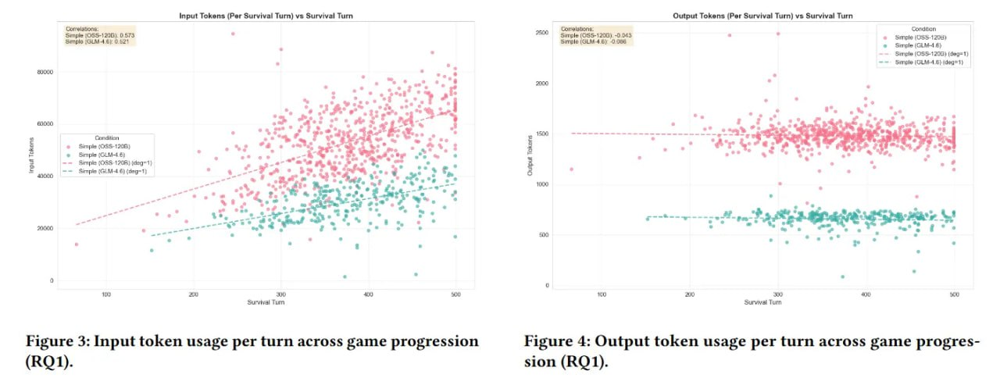

# Image Description

**File:** img_1772683033_aqad5xzrg3vmoel_figure_3_input_token_usage_per.jpg
**Original:** image.jpg
**Received:** 1772683033

## Extracted Text (OCR)

Figure 3: Input token usage per turn across game progression (ВО1).

<!-- image -->

Figure 4: Output token usage per turn across game progression (RQ1).

<!-- image -->

## Usage Instructions

When referencing this image in markdown:
1. Use relative path based on file location
2. Add descriptive alt text based on OCR content above
3. Add text description BELOW the image for GitHub rendering

Example:
```markdown
 <!-- TODO: Broken image path -->

**Image shows:** [Describe what the image contains based on OCR]
```
