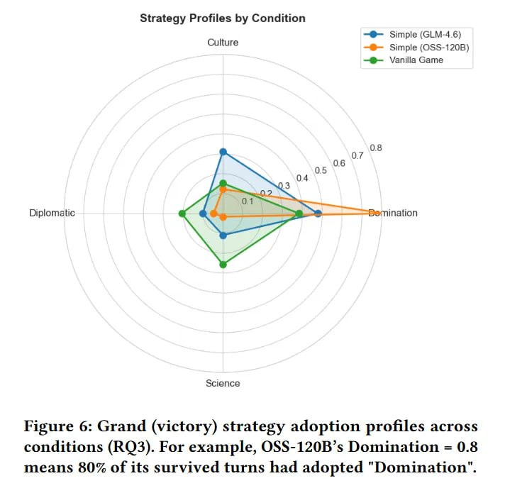

# Image Description

**File:** img_1772683033_aqad6rzrg3vmoel9_figure_6_grand_victory_strategy_adoption.jpg
**Original:** image.jpg
**Received:** 1772683033

## Extracted Text (OCR)

Figure 6: Grand (victory) strategy adoption profiles across conditions (ВОЗ). For example, OSS-120B's Domination = 0.8 means 80% of its survived turns had adopted "Domination".

<!-- image -->

## Usage Instructions

When referencing this image in markdown:
1. Use relative path based on file location
2. Add descriptive alt text based on OCR content above
3. Add text description BELOW the image for GitHub rendering

Example:
```markdown
 <!-- TODO: Broken image path -->

**Image shows:** [Describe what the image contains based on OCR]
```
