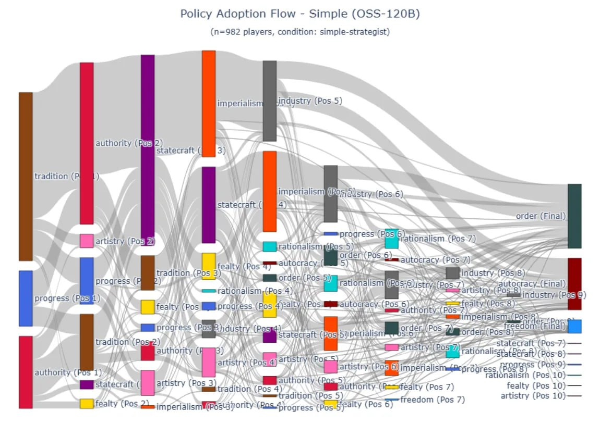

# Image Description

**File:** img_1772683033_aqad7bzrg3vmoel_policy_adoption_flow_simple.jpg
**Original:** image.jpg
**Received:** 1772683033

## Extracted Text (OCR)

## Policy Adoption Flow - Simple (OSS-120B)

(n=98? players, condition: simple-strategist)

<!-- image -->

## Usage Instructions

When referencing this image in markdown:
1. Use relative path based on file location
2. Add descriptive alt text based on OCR content above
3. Add text description BELOW the image for GitHub rendering

Example:
```markdown
 <!-- TODO: Broken image path -->

**Image shows:** [Describe what the image contains based on OCR]
```
