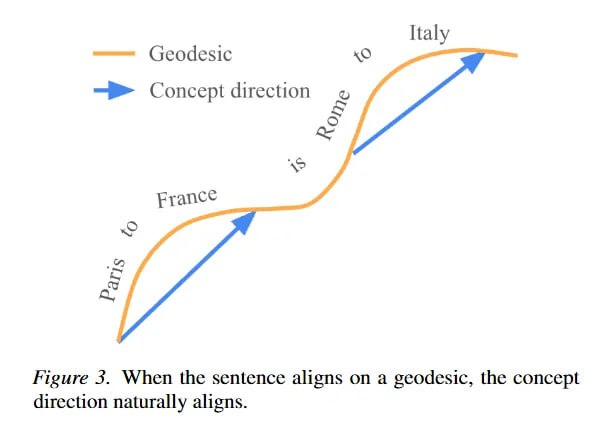

# Image Description

**File:** img_1772683207_aqad4hbrg9etsul9_figure_2_when_the_sentence_aligns.jpg
**Original:** image.jpg
**Received:** 1772683207

## Extracted Text (OCR)

Figure 2. When the sentence aligns on a geodesic, the concept direction naturally aligns.

<!-- image -->

## Usage Instructions

When referencing this image in markdown:
1. Use relative path based on file location
2. Add descriptive alt text based on OCR content above
3. Add text description BELOW the image for GitHub rendering

Example:
```markdown
 <!-- TODO: Broken image path -->

**Image shows:** [Describe what the image contains based on OCR]
```
