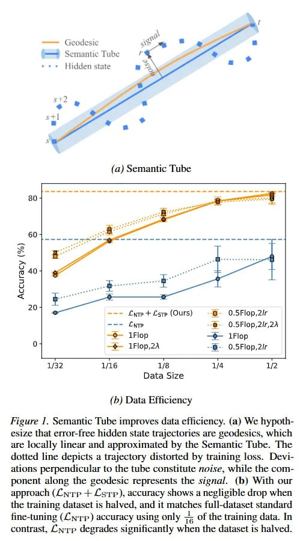

# Image Description

**File:** img_1772683207_aqad5bbrg9etsul_fp_data_image.jpg
**Original:** image.jpg
**Received:** 1772683207

## Extracted Text (OCR)

fp) Data ЕИклепсу

<!-- image -->

<!-- image -->

fieure Г. Semantic lube improves data efficiency. (a) We bypothesize that error-free hidden state trajectories are seodesics, which are locally linear and approximated by the Semantic lube. [he dotted line depicts a trajectory distorted бу traiming loss. Deviations perpendicular to the tube constitute netse, while the component along the geodesic represents the signal. (b) With our approach (мгр + Стр), accuracy shows а negligible drop when the traiming dataset is halved, and И matches Tfull-dataset standard fine-tuning (Crp) accuracy using only = = of the training data. In contrast, 2ypp degrades significantly when the dataset is halved.

## Usage Instructions

When referencing this image in markdown:
1. Use relative path based on file location
2. Add descriptive alt text based on OCR content above
3. Add text description BELOW the image for GitHub rendering

Example:
```markdown
 <!-- TODO: Broken image path -->

**Image shows:** [Describe what the image contains based on OCR]
```
