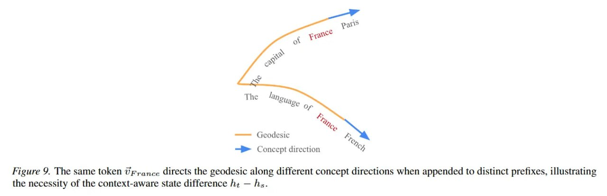

# Image Description

**File:** img_1772683207_aqad5rbrg9etsul_image_figure_9_the.jpg
**Original:** image.jpg
**Received:** 1772683207

## Extracted Text (OCR)

<!-- image -->

Figure 9. The same token Uryance directs the geodesic along different concept directions when appended to distinct prefixes, illustrating the necessity of the context-aware state difference 1, — Ns.

## Usage Instructions

When referencing this image in markdown:
1. Use relative path based on file location
2. Add descriptive alt text based on OCR content above
3. Add text description BELOW the image for GitHub rendering

Example:
```markdown
 <!-- TODO: Broken image path -->

**Image shows:** [Describe what the image contains based on OCR]
```
