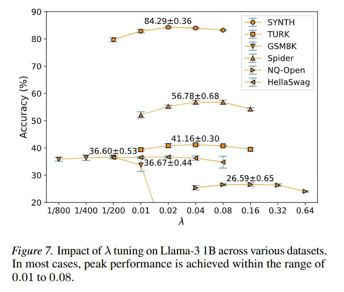

# Image Description

**File:** img_1772683207_aqad5xbrg9etsul9_figure_7_impact_of_a_tuning.jpg
**Original:** image.jpg
**Received:** 1772683207

## Extracted Text (OCR)

Figure 7. Impact of A tuning on Llama-3 1B across various datasets. In most cases, peak performance 1s achieved within the range of ().01 to O.08.

<!-- image -->

## Usage Instructions

When referencing this image in markdown:
1. Use relative path based on file location
2. Add descriptive alt text based on OCR content above
3. Add text description BELOW the image for GitHub rendering

Example:
```markdown
 <!-- TODO: Broken image path -->

**Image shows:** [Describe what the image contains based on OCR]
```
