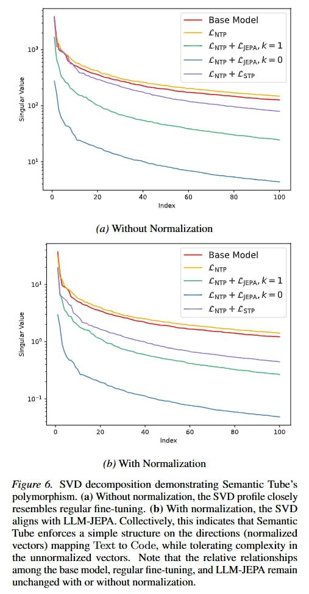

# Image Description

**File:** img_1772683207_aqad6hbrg9etsul_image_fo_with.jpg
**Original:** image.jpg
**Received:** 1772683207

## Extracted Text (OCR)

<!-- image -->

## fo) With Normalization

fieure 6. SVD decomposition demonstrating semantic lubes polymorphism. (a) Without normalization, the SVD profile closely resembles regular fine-tuning. (Db) With normalization, the SVD aligns with LILM-JEPA. Collectively, this indicates that Semantic lube enforces a simple structure on the directions (normalized vectors) mapping 'Text to Code, while tolerating complexity in the unnormalized vectors. Note that the relative relationships among the Dase model, regular fine-tuning, and LLM-JEPA remain unchanged with or without normalization.

## Usage Instructions

When referencing this image in markdown:
1. Use relative path based on file location
2. Add descriptive alt text based on OCR content above
3. Add text description BELOW the image for GitHub rendering

Example:
```markdown
 <!-- TODO: Broken image path -->

**Image shows:** [Describe what the image contains based on OCR]
```
