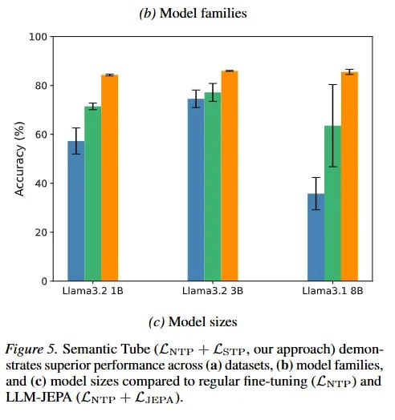

# Image Description

**File:** img_1772683207_aqad6rbrg9etsul9_b_gt_model_families_fieure_5.jpg
**Original:** image.jpg
**Received:** 1772683207

## Extracted Text (OCR)

## (b&gt;) Model families

Fieure 5. Semantic Tube (Ёчтр + £erp, our approach) demonstrates superior performance across (a) datasets, (b) model families, and (с) model sizes compared to regular fine-tuning (С мгр} and LLM-JEPA (fn-rp + ЁтерА).

<!-- image -->

## Usage Instructions

When referencing this image in markdown:
1. Use relative path based on file location
2. Add descriptive alt text based on OCR content above
3. Add text description BELOW the image for GitHub rendering

Example:
```markdown
 <!-- TODO: Broken image path -->

**Image shows:** [Describe what the image contains based on OCR]
```
